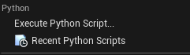

# RealSim CARLA documentation

## Table of Contents
- [CARLA Windows Build](#carla-windows-build)
- [Simulation Setups](#simulation-setups)
- [SUMO Traffic Lights Replication in CARLA](#sumo-traffic-lights-replication-in-carla)
- [Current Support of Co-Simulation Forms](#current-support-of-co-simulation-forms)
- [Helper Scripts](#helper-scripts)
- [Run Simulation](#run-simulation)

## Carla Windows Build

Please visit [Visual Studio Installer Download](https://visualstudio.microsoft.com/downloads/) to download the Visual Studio Installer

To build the CARLA 0.9.15 under Visual Studio 2019, a practical guide is shown below (For detailed build steps, please refer to [CARLA Windows Build Guide](./Carla_Windows_building.md).):

The MSVC toolset version changed to v142 after Visual Studio 2019. Since the official installation script supports MSVC 142, we use Visual Studio 2019 for simplicity. 

The documentation for building CARLA on windows can be found [Carla Windows Build](https://carla.readthedocs.io/en/0.9.15/build_windows/). Please note that, we need to use "X64 Native Tools Command Prompt for VS 2019" for compilation.

Remember to follow every steps in the CARLA Windows build documentation. 

If you don't need to use the source version CARLA as the server. You dont need to compile the Carla Server follwing the documentation. You can just run:

```shell
make LibCarla GENERATOR="Visual Studio 2019" TOOLSET="msvc-14.2"
```

which will provide the necessary dependencies for the FIXS-CARLA

### Providing libcarla to the build (automated — issue #109)

`VirCarlaEnv` links the Carla C++ client `CommonLib/libcarla` (~800 MB). It is
**gitignored** and acquired automatically by `scripts/dispatch/fetch_native_deps.ps1`
(dispatch step **4c**), driven by a per-machine `~/.fixs/carla.json`:

- **`"mode": "prebuilt"`** *(recommended — no Carla source build needed):* downloads
  the **public** rolling `fixs-native-deps` release's `libcarla-<carla_version>.zip` (Release subset),
  verifies its SHA-256, and extracts it into `CommonLib/`. This is the exact artifact
  the release CI uses.
- **`"mode": "source"`** *(for developers who build Carla from source):* after
  `make LibCarla`, copies `${carla_root}\PythonAPI\carla\dependencies\{lib,include}`
  into `CommonLib\libcarla`. Set `carla_root` in `~/.fixs/carla.json`.

Example `~/.fixs/carla.json`:

    { "mode": "source", "carla_root": "C:/src_ext/Carla" }

The dispatch then builds **VirCarlaEnv** — only the **Release** configuration is
supported (the Carla deps ship no debug Boost, and `carla_client_debug.lib` is dropped
from the hosted subset). To regenerate/republish the hosted deps after a Carla version
bump, run `scripts/dispatch/pack_native_deps.ps1 -Publish` on a box that has the source deps.

*(Manual fallback: copy `${CARLA_Root}\PythonAPI\carla\dependencies\` into
`${FIXS_Root}\CommonLib\` and rename it **libcarla**.)*

## Simulation Setups

```yaml
#pragma once
# Global Simulation setup
SimulationSetup:
    # Master Switch to turn on/off RealSim interface
    # if turned off, VISSIM will just run without RealSim
    # SUMO needs to run without traci
  EnableRealSim: true

    # Whether or not to save verbose log during the simulation. skip log can potentially speed up
  EnableVerboseLog: false

    # Simulation end time
    # if NOT specificed, SimulationEndTime will be set to a large value (90000 seconds)
    #--------------------------------------------------
  SimulationEndTime: 250

    # specify which traffic simulator
    #--------------------------------------------------
  SelectedTrafficSimulator: "SUMO"

    # default will send all
  VehicleMessageField: [id, type, vehicleClass, speed, acceleration, positionX, positionY, positionZ, heading,
    color, linkId, laneId, distanceTravel, speedDesired, grade, length, width, height]

    # by default it is false 
  EnableExternalDynamics: true   # use this so that simulink will control the response

  TrafficSimulatorIP: "127.0.0.1"
  TrafficSimulatorPort: 1337
SumoSetup:
    # set the speed mode, in integer. default value is 0
    # check Sumo documentation https://sumo.dlr.de/docs/TraCI/Change_Vehicle_State.html#speed_mode_0xb3

  SpeedMode: 32   # 31: default mode. 32: all checks off

# setup Application Layer
ApplicationSetup:
    # turn on/off application layer
  EnableApplicationLayer: true

    #--------------------------------------------------
  VehicleSubscription:
    # Application from where to accept the vehicle data
    # 1. Receive data from FIXS LAYER
    # 2. Send data to XIL LAYER / Back to FIXS LAYER
  - type: "ego"
    attribute: {id: ["ego"], radius: [50]}
    ip: ["127.0.0.1"]
    port: [440]


  SignalSubscription:
  - type: intersection
    attribute: {name: ['111', '139', '156', '167', '184']}
    ip: ['127.0.0.1']
    port: [440]
    
XilSetup:
    # enable/disable XIL
  EnableXil: false

CarlaSetup:
    
    # whether or not enable Carla (default: false)
    EnableCosimulation: true
    
	EnableVerboseLog: false
    # whether or not enable external control
    # if set to true, the sumo vehicles will be updated according to the carla vehicles' state
    # if set to false, the carla will be only visualizing the sumo vehicles
    EnableExternalControl: false
    
    # whether or not use vehicle type as blueprint  
    # if set to true, the carla vehicles will be created according to the vehicle type
    # if set to false, the carla vehicles will be spawned using random blueprint
    UseVehicleTypeAsBlueprint: true

    # Carla Server Ip and Port settings 
    CarlaServerIP: 127.0.0.1
    CarlaServerPort: 2000

    # Carla Client Ip and Port settings 
    CarlaClientIP: 127.0.0.1
    CarlaClientPort: 440

    # default Traffic Objects updates every 0.1 seconds
    TrafficRefreshRate: 0.1
    
    # Interested ids should be a subset of the vehicleSubscription ids
    InterestedIds: ["ego"]

    # center view at vehicle, the vehicle id should be a subset of the interested ids
    CenteredViewId: "ego"
```

## SUMO Traffic Lights Replication in CARLA 

### Derive Traffic Lights Table

The traffic light extraction script is located at `${FIXS_Root}\tests\SumoCarla\utils\extract_sumo_tls_as_table.py`. By specifying the sumo traffic network paths, it will generate the TLS table `traffic_light_table.csv` at the specified destination.

Or you can run the `${FIXS_Root}\tests\SumoCarla\setup_env.py`.

### Place Traffic Lights

To replicate the traffic lights in CARLA defined in the TLS table, we need to first open the CARLA map on which the traffic lights will be placed. Then specify the TLS table path `TLS_TABLE_PATH` in the TLS placing script at `{FIXS_Root}\tests\SumoCarla\unreal_scripts\placing_tls.py`. Use the CARLA Unreal Engine Python plug-in to run the script (Execute Python Script through Unreal as shown below). Click **File** and find the **Python** section. To enable the Python Plugin, please refer to [Scripting the Editor using Python](https://dev.epicgames.com/documentation/en-us/unreal-engine/scripting-the-editor-using-python?application_version=4.27).



Note that to change the blueprint of the traffic light, please modify the `TRAFFICLIGHT_HEAD_BLUEPRINT_PATH`.

## Current Support of Co-Simulation Forms

### SUMO Controls All Vehicles

If all the vehicles are controlled by SUMO, then `EnableExternalControl` should be set to **false**. Control commands sent to the CARLA world will not be applied to SUMO vehicles, or to CARLA vehicles, since all CARLA vehicles will follow the states from SUMO.

### Control Vehicles Externally through CARLA API

Setting `EnableExternalControl` to **true** enables vehicles to be controlled externally in the CARLA world. Another CARLA client can modify vehicle states and these changes will be reflected in SUMO.  
- If the vehicle is already defined in SUMO, it will be spawned and moved to the SUMO location.  
- If not, the vehicle will be spawned using its CARLA location.

### Control Vehicles Externally through FIXS

Partially Implemented.

## Helper Scripts

### Disable Synchronous Mode

Running **VirCarlaENV** sets the CARLA server to synchronous mode, which causes stopping the CARLA server directly to freeze. If you want to stop the simulation before it ends, synchronous mode should be disabled. A helper script to do this is located at:
```
${FIXS_Root}\tests\SumoCarla\carla_scripts\disable_carla_synchronous_mode.py
```

## Run Simulation

To run the simulation, we need to run at least three components:

1. CARLA Server  
2. SUMO  
3. FIXS-Core (Traffic Layer)  

For the **"SUMO Controls All Vehicles"** use case, there is an automatic script located at:
```
{FIXS_Root}\tests\SumoCarla\unreal_scripts\run_sumo_carla.py
```
, which runs the SUMO, FIXS-Core and FIXS-CARLA.

The CARLA Server should be manually started before running the script.

For the **"Control Vehicles Externally through CARLA API"** use case, an example could be a vehicle manually controlled using the CARLA API. A manual control script is located at:
```
{FIXS_Root}\tests\SumoCarla\carla_scripts\mannual_control.py
```
After starting the server, run the manual control script and then the automatic script.
