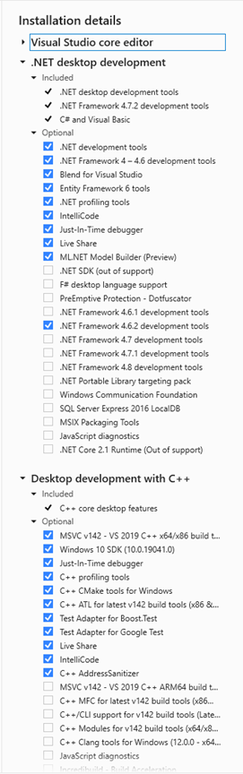

## CARLA 0.9.15 Windows Build Guide

This document provides a practical guide for building CARLA 0.9.15 on Windows.

> **This guide is for 0.9.15, which FIXS currently targets.** For 0.9.16 see
> [`Carla_0916_Windows_building.md`](./Carla_0916_Windows_building.md) — it requires Visual
> Studio 2022 rather than 2019, and most of the workarounds below do not carry over. For
> Linux see [`Carla_Linux_building.md`](./Carla_Linux_building.md).
>
> One correction that applies to **both** versions: the installer scripts live in
> `Util/InstallersWin` (with the `s`), not `Util/InstallerWin` as written in Part Two §3
> below.

For the official and complete build procedure, please refer to the 
[CARLA 0.9.15 Windows Build Documentation](https://carla.readthedocs.io/en/0.9.15/build_windows/).

This document follows the structure of Part One: Prerequisites and Part Two: Build CARLA from the official documentation, and focuses on:
- Highlighting common issues encountered during the build process  
- Providing practical solutions and workarounds  

---

## Part One: Prerequisites

Please strictly follow the **System requirements** and **Software requirements** specified in the official documentation. In particular:

- Ensure that the required version of **Make (3.81)** is used. This version may need to be installed manually (e.g., via Gnuwin), or obtained through other reliable sources.

- For **Visual Studio 2019**, make sure the correct **MSVC toolset** is selected. Note that the **Windows 8.1 SDK** may no longer be available and can be replaced with the **Windows 10 SDK**.



- The installation and configuration of **Unreal Engine 4.26** can be completed by following the official CARLA documentation:  
  [CARLA Windows Build Documentation](https://carla.readthedocs.io/en/0.9.15/build_windows/#unreal-engine)

Please ensure all dependencies are correctly installed before proceeding to the build stage. Users can verify dependencies using:

```
- `python --version`  
- `pip3 -V`  
- `cmake --version`  
- `make --version`  
- `git --version`  
```

Visual Studio toolset and Windows SDK can be checked via **Visual Studio Installer**.

---

## Part Two: Build CARLA 

This section describes how to build CARLA on Windows. The detailed procedure follows the official documentation, while this section primarily highlights common issues encountered during the build process and provides corresponding solutions.

### Clone the CARLA Repository
- Clone the CARLA repository from GitHub
- **Ensure that the correct version/tag (0.9.15) is checked out.**

### Get assets
- Run Update.bat scripts
- Download required assets

The assets will be automatically downloaded and extracted if the process completes successfully.

However, in practice, the download via Update.bat may fail due to network issues or version mismatches.

Common Issue: Assets Download Failure

If Update.bat fails to download the assets, a manual workaround is required.

Solution: Manual Download and Extraction

Identify the correct asset version for CARLA 0.9.15:
20231108_c5101a5

The correct asset version can be identified from:

`Util/ContentVersions.txt` in the CARLA source directory, which maps each CARLA version to its corresponding asset package.

Manually download the corresponding asset package.
Extract the downloaded archive to:
Unreal/CarlaUE4/Content/Carla

Note: If the target directory does not exist, create it manually.

This manual approach ensures that the correct assets are used when the automated script does not work properly

Locate the file:
Util/ContentVersions.txt

This file contains the mapping between CARLA versions and their corresponding asset packages.

### Build CARLA

This section covers the build process of CARLA on Windows.  
The overall procedure follows the official documentation, while this section focuses on issues encountered during the `make PythonAPI` step and their corresponding solutions.

---

#### Compile the Python API client

Run the following command in the CARLA root directory:

```bash
make PythonAPI
```

During this step, several issues may arise. The most common ones and their solutions are listed below:

1. Missing dependencies during build (zlib / xerces-c)

Problem:
Some dependencies cannot be downloaded automatically during the build process (e.g., zlib, boost, xerces-c).

Solution:

Manually download the required packages:
zlib [v1.2.13](https://github.com/madler/zlib/tags)
[xerces-c-3.2.3] (https://archive.apache.org/dist/xerces/c/3/sources/)
Extract them into the corresponding Build directory
Ensure the folder names match exactly (e.g., xerces-c-3.2.3-source)

2. Boost download failure in install_boost.bat

Problem:
install_boost.bat fails to download Boost automatically.

Solution:

- Manually download Boost (e.g., version 1.80.0)
Extract them into the corresponding Build directory
Ensure the folder names match exactly (e.g., boost-1.80.0-source)
or
- Modify install_boost.bat (around line 74) to use a valid download source
```
set BOOST_REPO=https://boostorg.jfrog.io/artifactory/main/release/%BOOST_VERSION%/source/%BOOST_TEMP_FILE%
```
to 
```
set BOOST_REPO=https://archives.boost.io/release/%BOOST_VERSION%/source/%BOOST_TEMP_FILE%
```
3. CMake policy/version error during build

Problem:
CMake configuration fails due to policy/version issues.

Solution:

1). Modify the .bat scripts under:
Util/InstallerWin

2). Add the following flag to the CMake command:
```
-DCMAKE_POLICY_VERSION_MINIMUM=3.5
```
3). Ensure variables such as %XYZ_SRC_DIR% are correctly set if required
```
%XYZ_SRC_DIR%
```
to
```
%XYZ_SRC_DIR%.
```

4. CMake issues in OSM build tools

Problem:
CMake errors occur when running scripts in:

Util/BuildTools

Solution:

Modify BuildOSM2ODR.bat
1). Add the following flag to the CMake command:
```
-DCMAKE_POLICY_VERSION_MINIMUM=3.5
```
2). Modify the line:
```
%OSM2ODR_SOURCE_PATH%
```
to
```
%OSM2ODR_SOURCE_PATH%.
```

5. NumPy version incompatibility

- Ensure that the NumPy version is **< 2.0.0** to avoid build issues 

6. Python version requirement

Problem:
CARLA 0.9.15 requires **Python 3.10**. On Windows, multiple Python versions may be installed simultaneously, and both `py` and `py3` may resolve to a different version (e.g., 3.11 or 3.12), causing `make PythonAPI` to fail with cryptic errors.

Verify which Python the launcher currently resolves to:
```
py --version
py3 --version
```

**Step 1 — Install Python 3.10 (if not already present):**

Download and install Python 3.10 from [python.org](https://www.python.org/downloads/release/python-31011/).

During installation:
- Check **"Add Python 3.10 to PATH"**
- Choose **"Install for all users"** if the build will be run by multiple users or from a system-level shell. This installs Python to `C:\Program Files\Python310\` and makes it available system-wide. If installing for yourself only, the default per-user install (`%LOCALAPPDATA%\Programs\Python\Python310\`) is sufficient.

**Step 2 — Pin `py` and `py3` to Python 3.10 via `py.ini`:**

Create (or edit) a `py.ini` file. The correct location depends on your Python install scope:

| Install scope | `py.ini` location |
|---|---|
| Current user only | `%LOCALAPPDATA%\py.ini` (e.g., `C:\Users\<you>\AppData\Local\py.ini`) |
| All users (system-wide) | Same directory as `py.exe`, typically `C:\Windows\py.ini` |

Add the following content to `py.ini`:
```
[defaults]
python=3.10
python3=3.10
```

Verify after saving:
```
py --version    # should report Python 3.10.x
py3 --version   # should report Python 3.10.x
```

**Step 3 — Install required Python packages under Python 3.10:**

Ensure the following packages are installed specifically for Python 3.10, not just the system default:
```
py -3.10 -m pip install setuptools wheel "numpy<2.0.0"
```

---