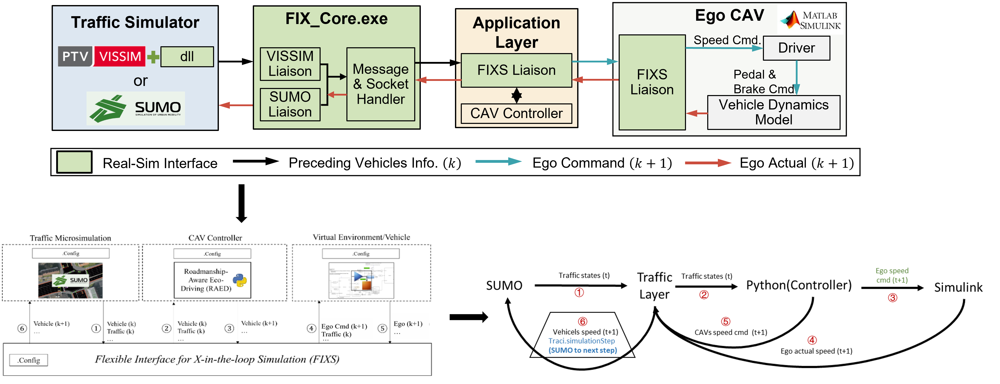
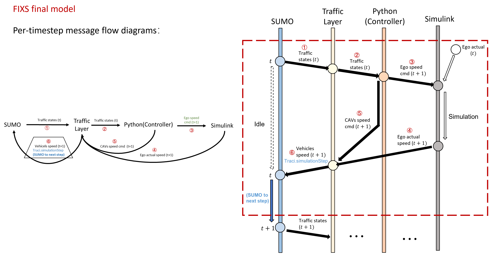
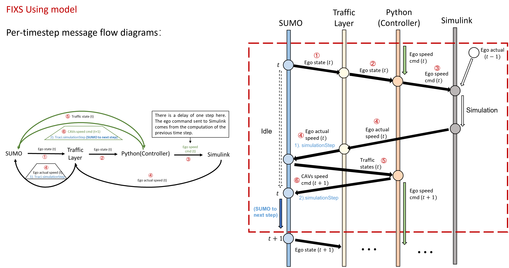
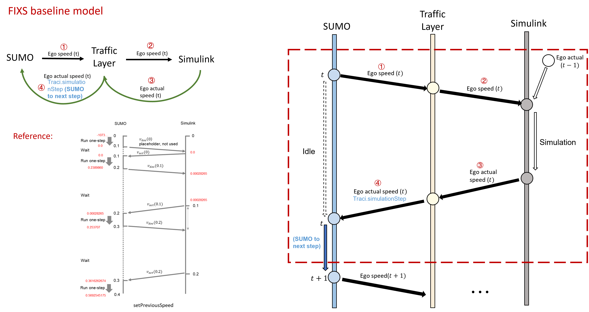

# Traffic–Vehicle Co-Simulation Framework

This document provides an overview of the co-simulation framework used in this project, which integrates:

- **SUMO traffic simulation**
- **Traffic layer (C++ / FIXS)**
- **Python controller**
- **Simulink high-fidelity vehicle dynamics model**

The figures below illustrate the system architecture and the message flow between different components under several modeling assumptions.

---

# 1. Co-Simulation Model Overview

The following figure shows the overall structure of the co-simulation framework used in this project.  
It illustrates how the traffic simulation layer, control layer, and high-fidelity vehicle model interact with each other.

---

# 2. Final model message Flow

This figure illustrates the **Final and ideal message flow** for the co-simulation framework.

In this architecture:

- The traffic simulator provides vehicle states.
- The controller computes control commands.
- The high-fidelity vehicle model generates physically consistent vehicle responses.
- The resulting states are fed back into the traffic simulator.

This design represents the **target architecture** for fully consistent traffic–vehicle co-simulation.

---

# 3. Current Implementation

The following diagram shows the **current implementation** used in the project.

Compared to the ideal framework, some components or data pathways may be different due to implementation constraints.

This figure highlights how information currently flows between:

- SUMO
- Traffic Layer
- Python controller
- Simulink vehicle model

In the current architecture, the **speed command applied to the ego vehicle has a one-step delay** due to the message exchange sequence. The main reason is that SUMO has two clients: Python and Traffic Layer.
For implementation details, please refer to the Python control code.

---

# 4. Baseline Model

The baseline model represents a simplified configuration used for comparison with the proposed co-simulation framework.

In this setup, the ego vehicle does **not obtain a speed command from the controller**.  
Instead, vehicle states from the traffic simulator are directly passed to the **high-fidelity vehicle dynamics model**, which computes the vehicle response and returns the resulting states to the traffic simulatior.

This configuration is used as a **reference case** for evaluating the impact of the controller and the co-simulation framework.

---

# Notes

This document provides a high-level overview of the simulation architecture.  
More detailed explanations of each component and interface will be added in future updates.