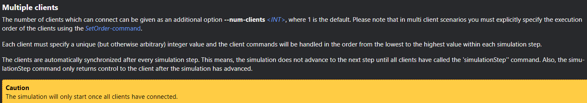
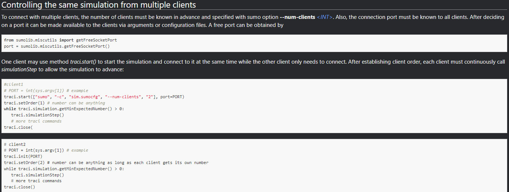

# RealSim SUMO documentation

## Contacts
Yunli Shao\
realsimxil@gmail.com

## Table of Contents
* [Simulation Setups](#simulation-setups)
* [Specific Features for SUMO Co-simulation](#specific-features-for-sumo-co-simulation)
    * [Speed Limit](#speed-limit)
    * [Preceding Vehicle](#preceding-vehicle)
    * [Multiple Clients](#multiple-clients)
* [SumoSetup in config.yaml](#sumosetup-in-configyaml)
* [Relayed TraCI: import fixs.traci as traci (#356)](#relayed-traci-import-fixstraci-as-traci-356)
* [Performance & TraCI transport (libtraci vs libsumo)](#performance--traci-transport-libtraci-vs-libsumo)

## Simulation Setups
1. Select the message data fields, ip address and port of the TrafficLayer, vehicle id of interest in the config.yaml. In this example, vehicle id 'vehicle_0' is selected, ip address is '127.0.0.1', port is 420.  
```yaml
# Global Simulation setup
SimulationSetup:
    
    # Master Switch to turn on/off RealSim interface
    # if turned off, VISSIM will just run without RealSim
    # SUMO needs to run without traci
    EnableRealSim: true
    
    # Whether or not to save verbose log during the simulation. skip log can potentially speed up
    EnableVerboseLog: false
    
    # Simulation end time
    # if NOT specificed, SimulationEndTime will be set to a large value (90000 seconds)
    #--------------------------------------------------
    #SimulationEndTime: 1800
    
    # specify which traffic simulator
    #--------------------------------------------------
    SelectedTrafficSimulator: 'SUMO'

    # default will send all
    VehicleMessageField: [id, type, speed, acceleration, positionX, positionY, positionZ, color, linkId, laneId, distanceTravel, speedDesired]

    # by default it is false 
    EnableExternalDynamics: true 


# ip and port are server ip and port

# setup Application Layer
ApplicationSetup:
    # turn on/off application layer
    EnableApplicationLayer: false
    
    #--------------------------------------------------
    VehicleSubscription: 

        
# subscription in XilSetup must be subset of ApplicationSetup
XilSetup:
    # enable/disable XIL
    EnableXil: true
    
    #--------------------------------------------------
    VehicleSubscription: 
    -   type: ego
        attribute: {id: ['vehicle_0'], radius: [0]}
        ip: ["127.0.0.1"]
        port: [420]
```
1. Create a batch file to run. Launch of the TrafficLayer.exe can be within this batch file or within matlab script, see next step. 
```bat
start sumo -c .\osm.sumocfg --remote-port 1337 --step-length 0.1 --start --netstate-dump osm_out.xml --netstate-dump.precision 5 --num-clients 1

:: can start TrafficLayer.exe here or in matlab script
::start cmd /k ..\..\realsimrelease\TrafficLayer.exe -f config_SUMOdriver.yaml 

```

1. Create a runSumo.m matlab script to specify the RealSim library folder, yaml configuration file, and simulink model. Then call the batch script to launch SUMO and start TrafficLayer.exe. Then initialize simulink using RealSimInitSimulink and start Simulink. 
```matlab
% initialization of vehicle data subscription setup before runnning any
% simulink files. A config.yaml needs to present to read the vehicle data
% subscription setup.

close all;clear all;clc;format compact;

%% Initializations
RealSimPath = '..\..\CommonLib';
configFilename = '.\config_SUMOdriver.yaml';
stopTime = 250; % simulation stop time in seconds. co-simulation will automatically stop after this seconds
simModelName = 'sumoDriverClient';

%% add path of RealSim tools
addpath(genpath(RealSimPath))

%% Run Batch Scripts
system("runSUMOdriver.bat")
system(['start cmd /c ..\..\TrafficLayer\x64\Release\TrafficLayer.exe -f ', sprintf('%s', configFilename)])

%% Initialize RealSim for Simulink, Read yaml file
[VehicleMessageFieldDefInputVec, VehDataBus, TrafficLayerIP, TrafficLayerPort] = RealSimInitSimulink(configFilename);
RealSimPara = struct;
RealSimPara.speedInit = 0; % initial speed of the ego vehicle when entering SUMO network
RealSimPara.tLookahead = 0.1; % use 0.1 for exteranl control, recommend to use tLookahead >= 0.2 for SUMO driver
RealSimPara.smoothWindow = 1; % number of moving average data point, 1 essentially mean no moving average

RealSimPara.speedSource = 2; % select sine wave for tracking

%% RealSim Start Procedure
tic

% start simulink model
% !!! specify the followings: 
%   1) simulink model name
%   2) stopTime of the simulink model
load_system(simModelName)
set_param(simModelName,'StopTime',num2str(stopTime));
% set_param(simModelName, 'SimulationCommand', 'start');
VehicleOut = sim(simModelName); % alternatively can use 'sim' command

sim_time = toc
```


## Specific Features for SUMO Co-simulation
### Speed Limit
- In SUMO, speed limit can be specified on the entire edge or on a lane of an edge. Real-Sim supports retrieving speed limit of both implementations.
- Junctions in SUMO can be assigned a different speed limit than edges connecting to them. Currently Real-Sim will neglect any speed limit specified on junctions. 
- In SUMO, different vehicle types can have different speed limit, which is not currently supported by Real-Sim. 
- For next speed limit, if multiple lanes have different speed limits, Real-Sim will return any of the speed limits since it does not know which lane the ego vehicle will drive ahead of time. 
- If route of the ego is changed during simulation, then the speed limit information from Real-Sim may not reflect the latest route.

### Preceding Vehicle
- Real-Sim will only consider any vehicle within 1000 meters radius of the ego vehicle as the lead vehicle/preceding vehicle. In the future, this radius will be a parameter that can be changed in config.yaml

### Multiple Clients
SUMO natively supports multiple TraCI clients. So Real-Sim can be used by another application, e.g., a python script, together with SUMO. The following shows an example to run a python script together with Real-Sim

- in the runSumo.bat, specify to have total of **2 clients**. Both the python script and Real-Sim will connect to SUMO through port **1337**
```bat
start sumo-gui -c .\speedLimit.sumocfg --remote-port 1337 --step-length 0.1 --start --num-clients 2
```
- inside python script, connects to the SUMO, assuming it is running at localhost IP address 127.0.0.1. Note since we started SUMO from the runSumo.bat, here we call ```traci.init``` rather than ```traci.start```. Also, note ```traci.setOrder``` is mandatory for multiple TraCI clients. By default, Real-Sim will always be order 1, so python script have to be in order >= 2
```python
PORT = int(1337)
traci.init(PORT,host="localhost")
traci.setOrder(2)

#....
# more traci commands
#....
```

There should be no need to modify anything on the Real-Sim side. In the future, the setOrder of Real-Sim can be one argument user can change in the yaml. For more information, check the following screenshots from SUMO documentation

https://sumo.dlr.de/docs/TraCI.html

https://sumo.dlr.de/docs/TraCI/Interfacing_TraCI_from_Python.html



## SumoSetup in config.yaml
In the config.yaml, there is a section that can define specific settings for SUMO simulation. For example:
```yaml
SumoSetup:
    # set the speed mode, in integer. default value is 0
    # check Sumo documentation https://sumo.dlr.de/docs/TraCI/Change_Vehicle_State.html#speed_mode_0xb3

    SpeedMode: 32
```
The SpeedMode is an integer defines behavior of SetSpeed command of SUMO TraCI API. More parameters can be included in SumoSetup for future releases.

## Relayed TraCI: `import fixs.traci as traci` (#356)

A script that already drives SUMO through TraCI can keep its `traci.*` calls while
running as a FIXS client. Change one import:

```diff
-import traci
+import fixs.traci as traci
```

```python
import fixs
import fixs.traci as traci

fixs.connect('config.yaml')
while True:
    fixs.recv()                                   # the tick, as usual
    links = traci.lane.getLinks('e0_1')           # relayed to FIXS's own connection
    if congested(links):
        traci.vehicle.changeLane('ego', 1, 3.0)
    fixs.send()
```

Turn it on with `SumoSetup.EnableTraciRelay: true`. It is off by default.

**This is not a second TraCI client.** The alternative -- opening your own
`traci.init()` alongside FIXS -- makes you a client under SUMO's multi-client
protocol (see *Multiple Clients* above): `--num-clients 2`, a mandatory `setOrder`,
and a simulation that does not advance until every client has stepped. Get the
stepping contract wrong and it deadlocks. The relay has none of that, because there
is still exactly one connection: yours goes to TrafficLayer, which executes the
command on the libtraci connection it already holds.

### What it does not relay

| Call | Why, and what to use |
| --- | --- |
| `traci.simulationStep()` | TrafficLayer owns the clock. `fixs.recv()` / `fixs.send()` advance the co-simulation. |
| `traci.close()` | TrafficLayer owns the session. `fixs.close()`. |
| `traci.load()` | Would reload the network under a running co-simulation. |
| `traci.setOrder()` | Meaningless: FIXS is the only TraCI client. |
| `*.subscribe()` / `subscribeContext()` | **The FIXS feed *is* the subscription.** The vehicles and fields your config named arrive on every `recv()`; read them with `fixs.vehicle.get(id)` / `getAll()`, which cost nothing per call because the data is already in the process. |

`traci.start()` and `traci.init()` are neither relayed nor refused: they *verify*. A
script that opens with `traci.start(['sumo', '-c', 'mynet.sumocfg'])` keeps that line,
and FIXS checks the `.sumocfg` against `SumoSetup.SumoConfigFile`. If they disagree
you are told immediately, instead of discovering fifty ticks later that your script
and the co-simulation are reasoning about different networks.

### Rules

- **Call only between `recv()` and `send()`** -- the window in which your controller
  runs. TrafficLayer serves relayed commands from inside its wait for your tick
  answer; outside that window nothing is listening, so the call raises rather than
  hanging.
- **Every call is a round trip.** A relayed getter costs what a TraCI getter has
  always cost (~30 us of SUMO round trip, measured, plus the FIXS hop) and it is paid
  inside the lockstep. Twenty getters across two hundred vehicles every tick will
  slow the co-simulation down; the feed is there precisely so that per-tick state
  does not have to be asked for.
- **`import fixs.traci` rebinds the real `traci` module's domains**, since there is
  only one `traci.vehicle` in a process. A third-party library that does its own
  `import traci` is relayed too. Usually what you want; occasionally a surprise.
- **libtraci builds only.** Under `ENABLE_LIBSUMO` SUMO runs in-process and there is
  no TraCI connection to relay onto; TrafficLayer says so at startup rather than
  failing later.

### How it works

Every one of traci's ~800 domain functions funnels through
`Connection._sendCmd(cmdID, varID, objID, format, *values)`, with the arguments
already serialized by traci's own `_pack`. `fixs.traci` replaces that one method:
the four values go to TrafficLayer as an RPC record on the FIXS socket
(`MSG_TRACI_REQUEST`, type 128 -- see `CommonLib/MsgTypes.h`), TrafficLayer executes
them with libtraci's generic executor `Connection::doCommand`, and the reply comes
back as bytes that traci's own parsers read unmodified. **Neither side enumerates the
TraCI API, and the payload is opaque end to end** -- TrafficLayer never learns what
`0x13` means.

Evidence that this is exact rather than approximate, including the byte-for-byte
comparison against a real TraCI connection and the cost measurements:
`tests/Sumo/Probes/TraciRelay/FINDINGS.md`. Tests:
`tests/Python/unit/test_traci_relay.py` (no simulator) and
`tests/Python/TraciRelay/run_relay_test.ps1` (live co-simulation).

## Performance & TraCI transport (libtraci vs libsumo)

> Notes from the #177 investigation (measured, June 2026). Detailed data + reusable
> benchmark harnesses live in
> [`tests/Sumo/Probes/TrafficLayer_SUMO_CMoffice/PERF_177_TRACI.md`](../tests/Sumo/Probes/TrafficLayer_SUMO_CMoffice/PERF_177_TRACI.md).

### Which transport the build uses
`CommonLib/TrafficHelper.h` leaves `ENABLE_LIBSUMO` **commented out**, so the build
compiles the **`libtraci`** namespace — the *socket* TraCI client. `TrafficLayer`
therefore talks to a **separate `sumo`/`sumo-gui` process over TCP** (see
`run_sumo_cm_demo.bat`: `sumo-gui --remote-port ...`). The alternative, `libsumo`,
embeds SUMO **in-process** (no socket). The `#ifdef` is already in the header, so it is
a per-build choice.

Measured cost difference (SUMO 1.21, simple_loop, 36 veh):

| | per single getter call | bulk subscription (1 call/step, all veh) |
|---|---:|---:|
| libtraci (socket) | ~78 µs (TCP round-trip) | ~150 µs/step transport penalty |
| libsumo (in-process) | ~0.3 µs | baseline |

Implication: **libsumo only wins big against per-call patterns** (one TraCI getter per
vehicle per step). For a single bulk context subscription the socket penalty is only
~150 µs/step. So the fix for slow SUMO co-sim is to **stop making per-vehicle
individual TraCI calls** (fold data into the subscription / cache it), *not* to switch
transport. After that, libtraci ≈ libsumo and you keep the GUI.

### #177 root cause (slow SUMO↔CarMaker co-sim)
The dominant per-step cost was **`Vehicle::getNextTLS(vehID)` called per traffic
vehicle per step** in `TrafficHelper::parserSumoSubscription` (≈ 2.5 ms/veh →
~90 ms/step at 36 veh, RTF ≈ 1.1). It is **not** the context-subscription variable
list (that is ~free). `getNextTLS` is O(upcoming-route length); the SimpleLoop demand
uses `repeat="100000"` (~400 k-edge route) so it walks the whole thing. The data it
produces (`signalLight*`) is not even sent unless a `signalLight*` field is in
`VehicleMessageField`. Same for `getLeader`/`getSpeed` (→ `precedingVehicle*`). VISSIM
is immune because the DSProxy path makes **zero** per-vehicle TraCI calls.

### Why you cannot have libsumo + sumo-gui on Windows
`libsumo` cannot drive `sumo-gui` on Windows — confirmed at the SUMO source level
(`src/libsumo/GUI.cpp`, a hard `#ifdef WIN32 { WRITE_WARNING("Libsumo on Windows does
not work with GUI, falling back to plain libsumo."); return false; }`), present on the
latest `main` and unchanged through 1.27. Reason: libsumo drives the GUI **incrementally
from the simulation/client thread** instead of FOX's blocking main-thread event loop,
and **FOX windows are thread-affine** ("FOX really likes to work in the main thread") —
Win32's window/message model doesn't tolerate that, so it is hard-disabled (X11/Linux is
"highly experimental" but works). A separately-launched `sumo-gui` cannot attach to an
in-process libsumo sim (no server socket; it would be a *different* simulation). SUMO's
planned **FOX→Qt** migration (issue eclipse-sumo/sumo#311) has been backlogged since
2010, so do not count on it.

**Practical guidance:** keep **libtraci + `sumo-gui`** for interactive/demo runs (GUI,
real-time once the per-vehicle calls are fixed); use **libsumo headless** only for
max-throughput batch runs, where CarMaker IPGMovie / Carla already provide the visual.
