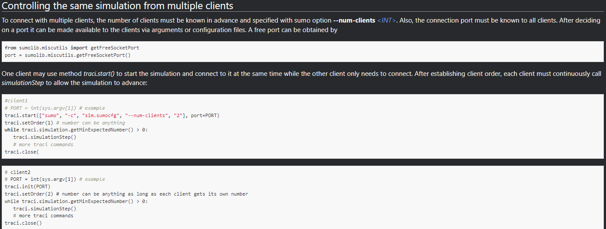

# RealSim SUMO documentation

## Contacts
Yunli Shao\
realsimxil@gmail.com

Table of Contents
=======================
* [Simulation Setups](#simulation-setups)
* [Specific Features for SUMO Co-simulation](#specific-features-for-sumo-co-simulation)
    * [Speed Limit](#speed-limit)
    * [Preceding Vehicle](#preceding-vehicle)
    * [Multiple Clients](#multiple-clients)
* [SumoSetup in config.yaml](#sumosetup-in-configyaml)

## Simulation Setups
1. Select the message data fields, ip address and port of the TrafficLayer, vehicle id of interest in the config.yaml. In this example, vehicle id 'vehicle_0' is selected, ip address is '127.0.0.1', port is 420.  
```yaml
# Global Simulation setup
SimulationSetup:
    
    # Master Switch to turn on/off RealSim interface
    # if turned off, VISSIM will just run without RealSim
    # SUMO needs to run without traci
    EnableRealSim: true
    
    # Whether or not to save verbose log during the simulation. skip log can potentially speed up
    EnableVerboseLog: false
    
    # Simulation end time
    # if NOT specificed, SimulationEndTime will be set to a large value (90000 seconds)
    #--------------------------------------------------
    #SimulationEndTime: 1800
    
    # specify which traffic simulator
    #--------------------------------------------------
    SelectedTrafficSimulator: 'SUMO'

    # default will send all
    VehicleMessageField: [id, type, speed, acceleration, positionX, positionY, positionZ, color, linkId, laneId, distanceTravel, speedDesired]

    # by default it is false 
    EnableExternalDynamics: true 


# ip and port are server ip and port

# setup Application Layer
ApplicationSetup:
    # turn on/off application layer
    EnableApplicationLayer: false
    
    #--------------------------------------------------
    VehicleSubscription: 

        
# subscription in XilSetup must be subset of ApplicationSetup
XilSetup:
    # enable/disable XIL
    EnableXil: true
    
    #--------------------------------------------------
    VehicleSubscription: 
    -   type: ego
        attribute: {id: ['vehicle_0'], radius: [0]}
        ip: ["127.0.0.1"]
        port: [420]
```
1. Create a batch file to run. Launch of the TrafficLayer.exe can be within this batch file or within matlab script, see next step. 
```bat
start sumo -c .\osm.sumocfg --remote-port 1337 --step-length 0.1 --start --netstate-dump osm_out.xml --netstate-dump.precision 5 --num-clients 1

:: can start TrafficLayer.exe here or in matlab script
::start cmd /k ..\..\realsimrelease\TrafficLayer.exe -f config_SUMOdriver.yaml 

```

1. Create a runSumo.m matlab script to specify the RealSim library folder, yaml configuration file, and simulink model. Then call the batch script to launch SUMO and start TrafficLayer.exe. Then initialize simulink using RealSimInitSimulink and start Simulink. 
```matlab
% initialization of vehicle data subscription setup before runnning any
% simulink files. A config.yaml needs to present to read the vehicle data
% subscription setup.

close all;clear all;clc;format compact;

%% Initializations
RealSimPath = '..\..\CommonLib';
configFilename = '.\config_SUMOdriver.yaml';
stopTime = 250; % simulation stop time in seconds. co-simulation will automatically stop after this seconds
simModelName = 'sumoDriverClient';

%% add path of RealSim tools
addpath(genpath(RealSimPath))

%% Run Batch Scripts
system("runSUMOdriver.bat")
system(['start cmd /c ..\..\TrafficLayer\x64\Release\TrafficLayer.exe -f ', sprintf('%s', configFilename)])

%% Initialize RealSim for Simulink, Read yaml file
[VehicleMessageFieldDefInputVec, VehDataBus, TrafficLayerIP, TrafficLayerPort] = RealSimInitSimulink(configFilename);
RealSimPara = struct;
RealSimPara.speedInit = 0; % initial speed of the ego vehicle when entering SUMO network
RealSimPara.tLookahead = 0.1; % use 0.1 for exteranl control, recommend to use tLookahead >= 0.2 for SUMO driver
RealSimPara.smoothWindow = 1; % number of moving average data point, 1 essentially mean no moving average

RealSimPara.speedSource = 2; % select sine wave for tracking

%% RealSim Start Procedure
tic

% start simulink model
% !!! specify the followings: 
%   1) simulink model name
%   2) stopTime of the simulink model
load_system(simModelName)
set_param(simModelName,'StopTime',num2str(stopTime));
% set_param(simModelName, 'SimulationCommand', 'start');
VehicleOut = sim(simModelName); % alternatively can use 'sim' command

sim_time = toc
```


## Specific Features for SUMO Co-simulation
### Speed Limit
- In SUMO, speed limit can be specified on the entire edge or on a lane of an edge. Real-Sim supports retrieving speed limit of both implementations.
- Junctions in SUMO can be assigned a different speed limit than edges connecting to them. Currently Real-Sim will neglect any speed limit specified on junctions. 
- In SUMO, different vehicle types can have different speed limit, which is not currently supported by Real-Sim. 
- For next speed limit, if multiple lanes have different speed limits, Real-Sim will return any of the speed limits since it does not know which lane the ego vehicle will drive ahead of time. 
- If route of the ego is changed during simulation, then the speed limit information from Real-Sim may not reflect the latest route.

### Preceding Vehicle
- Real-Sim will only consider any vehicle within 1000 meters radius of the ego vehicle as the lead vehicle/preceding vehicle. In the future, this radius will be a parameter that can be changed in config.yaml

### Multiple Clients
SUMO natively supports multiple TraCI clients. So Real-Sim can be used by another application, e.g., a python script, together with SUMO. The following shows an example to run a python script together with Real-Sim

- in the runSumo.bat, specify to have total of **2 clients**. Both the python script and Real-Sim will connect to SUMO through port **1337**
```bat
start sumo-gui -c .\speedLimit.sumocfg --remote-port 1337 --step-length 0.1 --start --num-clients 2
```
- inside python script, connects to the SUMO, assuming it is running at localhost IP address 127.0.0.1. Note since we started SUMO from the runSumo.bat, here we call ```traci.init``` rather than ```traci.start```. Also, note ```traci.setOrder``` is mandatory for multiple TraCI clients. By default, Real-Sim will always be order 1, so python script have to be in order >= 2
```python
PORT = int(1337)
traci.init(PORT,host="localhost")
traci.setOrder(2)

#....
# more traci commands
#....
```

There should be no need to modify anything on the Real-Sim side. In the future, the setOrder of Real-Sim can be one argument user can change in the yaml. For more information, check the following screenshots from SUMO documentation

https://sumo.dlr.de/docs/TraCI.html

https://sumo.dlr.de/docs/TraCI/Interfacing_TraCI_from_Python.html



## SumoSetup in config.yaml
In the config.yaml, there is a section that can define specific settings for SUMO simulation. For example:
```yaml
SumoSetup:
    # set the speed mode, in integer. default value is 0
    # check Sumo documentation https://sumo.dlr.de/docs/TraCI/Change_Vehicle_State.html#speed_mode_0xb3

    SpeedMode: 32
```
The SpeedMode is an integer defines behavior of SetSpeed command of SUMO TraCI API. More parameters can be included in SumoSetup for future releases.
