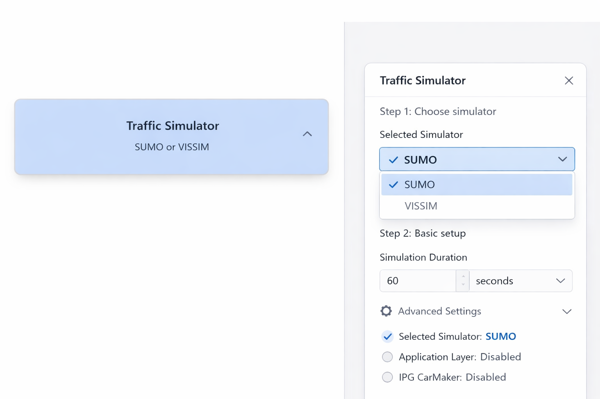
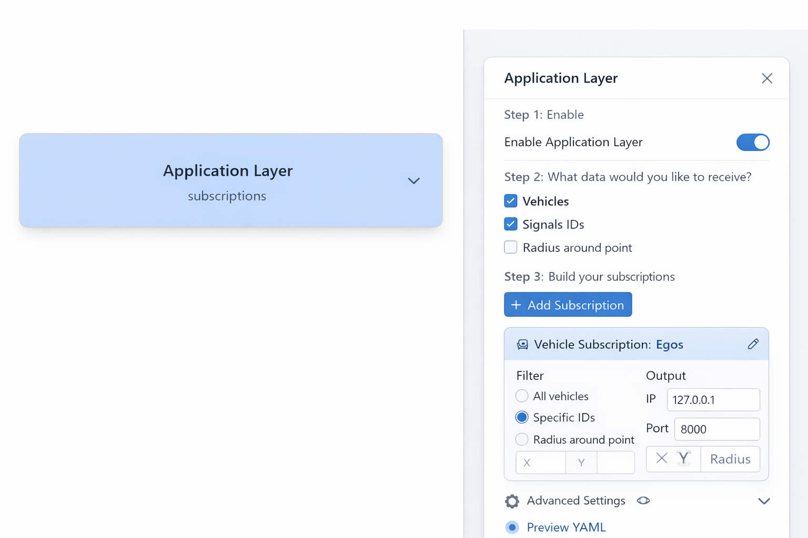
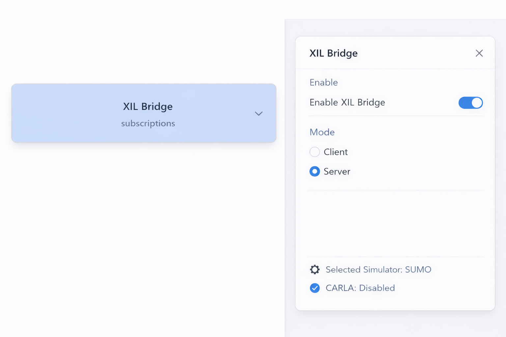
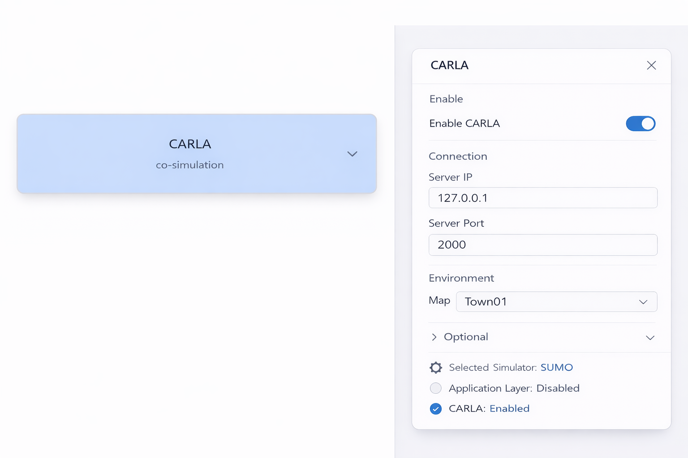
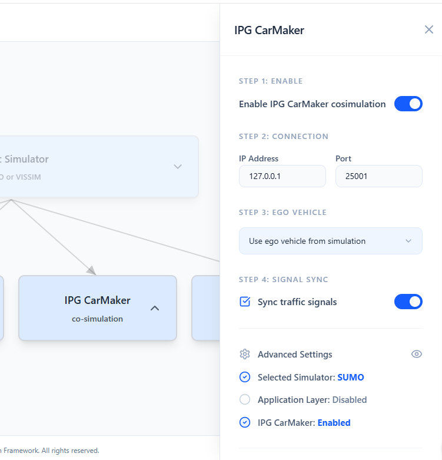
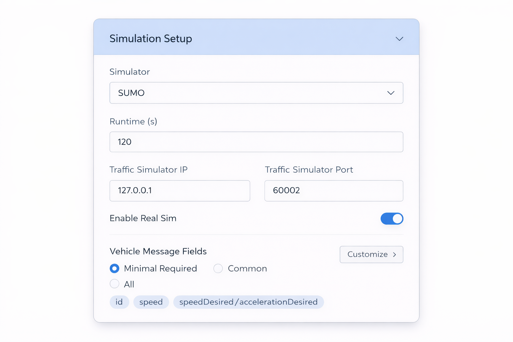
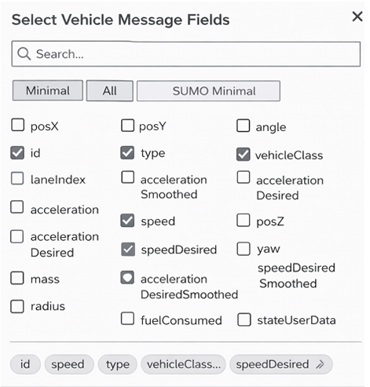
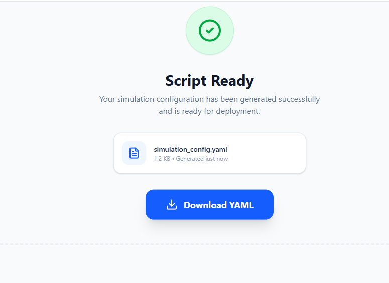

# GUI Design Documentation

## Overview
This document outlines the proposed GUI design for the FIXS configuration editor.

The goal is to make the interface more accesible and easier for users to navigate.
---
## Interaction Model

All components use a sidebar-based configuration panel.  
This keeps the main interface uncluttered while allowing detailed editing when needed.

---
## User Flow

The interface follows a step-by-step workflow:

1. Select Traffic Simulator
2. Choose integration layer (Application / XIL / CARLA / CarMaker)
3. Configure selected components
4. Define simulation parameters
5. Validate inputs
6. Generate configuration script

---

## Wireframes

### 1. Traffic Simulation Block

**Purpose:**  
This is the entry point of the system where the user selects the traffic simulator.  Once they hit done, the screen moves to give them an option between App Layer, XIL bridge, Carla and IPG CarMaker.

**System Mapping:**  
Maps to:
- `SimulationSetup.SelectedTrafficSimulator`
- `TrafficSimulatorIP`
- `TrafficSimulatorPort`

---

### 2. Application Layer

**Purpose:**  
Defines how vehicle data is processed and exchanged between the traffic simulator and external systems

---

### 3. XIL Bridge

**Purpose:**  
 Establishes communication between FIXS and external hardware or software systems through a standardized interface, enabling real-time data exchange and co-simulation
**System Mapping:**
- `XilSetup.EnableXil`
- `XilSetup.IsServer`
- `XilSetup.Subscriptions`

---

### 4. CARLA

**Purpose:**  
 Configures integration with the CARLA simulator to enable real-time vehicle control, environment interaction

**System Mapping:**
- `CarlaSetup.EnableExternalControl`
- `CarlaSetup.CarlaServerIP`
- `CarlaSetup.CarlaServerPort`

---
### 5. IPG CarMaker

**Purpose:**  
Sets up connection and co-simulation with IPG CarMaker for high-fidelity vehicle dynamics testing and validation within the simulation pipeline

---

### 6. Simulation Setup

**Purpose:**  
This stage consolidates all configuration inputs and allows the user to define global simulation parameters. 

**Key Inputs:**
- Execution order
- Step size
- Logging options
- Enabled modules

**Advanced Options:**
Users can expand “Vehicle Fields” to customize transmitted data.

**System Mapping:**
- `SimulationSetup.*`
- `VehicleMessageField`

---

### 7. Vehicle Fields

**Purpose:**  
While in simulation setup, after clicking advanced Vehicle Fields, this box will pop up with more advanced options for the user besides the default settings.

---

### 8. Script Generation

**Purpose:**  
Generates a ready-to-use `config.yaml` file based on user inputs, eliminating the need for manual configuration.

---